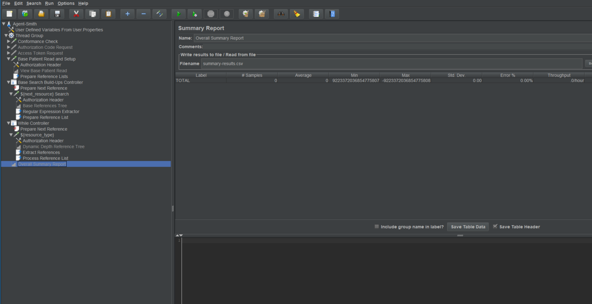
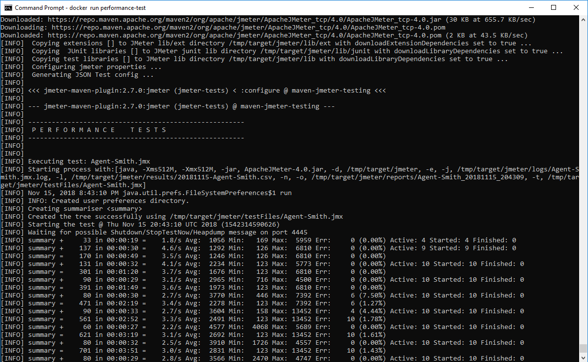
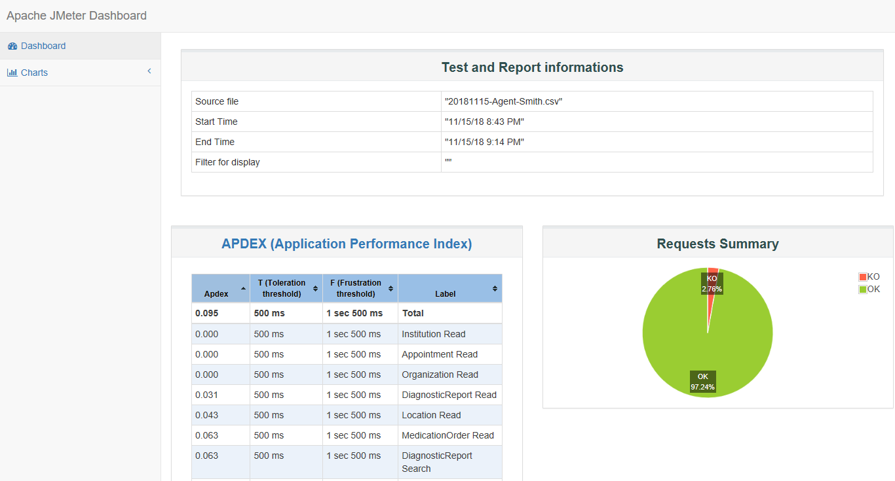

# agent-smith - Agent Smith

JMeter performance testing of health-apis.
 

## Design

Agent Smith utilizes Apache JMeter https://jmeter.apache.org/ to implement a dynamic performance
testing tool.

Enhancing Agent Smith is easiest through the GUI client of JMeter.

## Running

1. Obtain the user.properties file from a team member.

2. From the ~/agent-smith/src/main/docker directory, build the docker image with: `run docker build -t agent-smith:latest .`

3. From the same directory, run the docker image with: `docker run performance-test`

4. Depending on the number of threads and the `max.depth` property, this may take quite a while.  Once completed, run a `docker ps`, identify the `CONTAINER ID` and run `docker cp {container_id}:/tmp/target/ ./{desired_local_path}`

5. Open the ~/target/jmeter/reports/Agent-Smith_{run-date-time}/index.html for a graphical report and ~/target/jmeter/results/{date}-Agent-Smith

