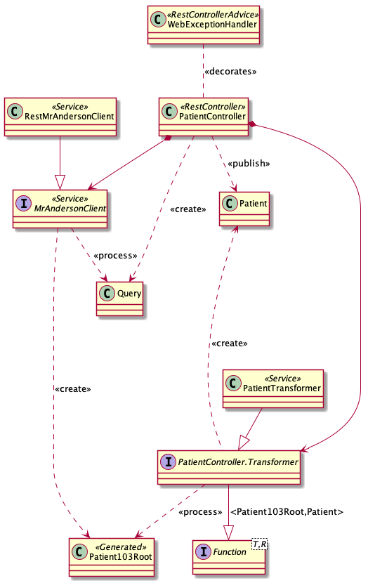

# argonaut - Argonaut

Spring Boot implementation of the 
[FHIR Argonaut specification](http://www.fhir.org/guides/argonaut/r2/profiles.html).
 

## Design

Argonaut is implemented as a series of resource-specific components the follow the template below.
To make the description more complete, the pattern is shown for _Patient_, but it is replicated
for each resource.

##### Components
- MrAndersonClient 
  - Query
- RestMrAndersonClient
- WebExceptionHandler
- {Resource}Controller
